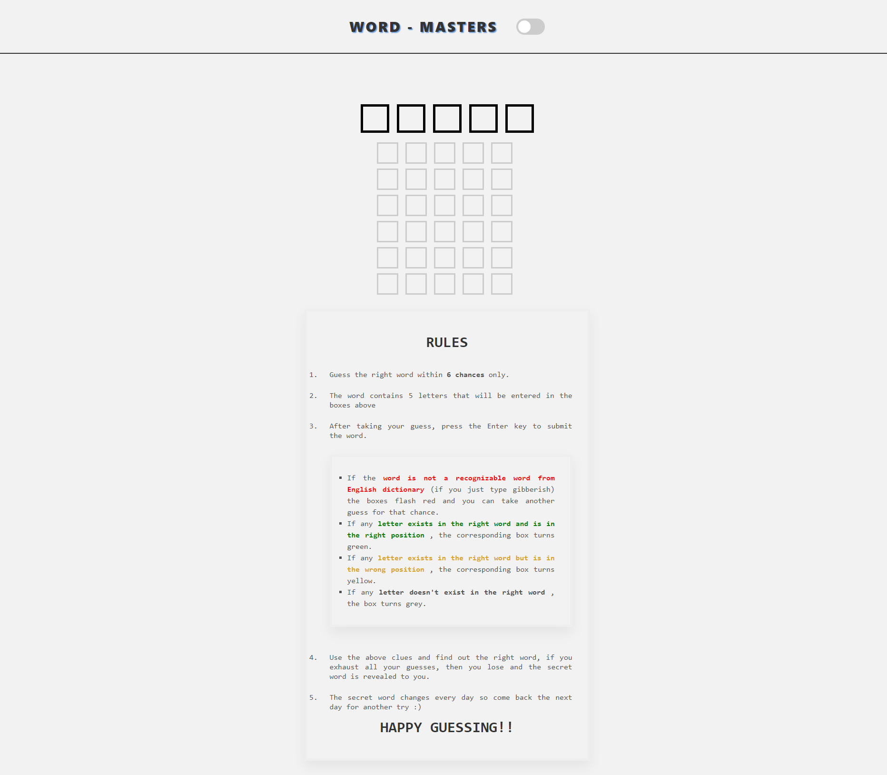

# **WORD-MASTERS (A WORDLE CLONE)**
A web-based clone of the popular game Wordle implemented using HTML, CSS and JavaScript.

### It uses an [API](https://words.dev-apis.com/word-of-the-day) to get random 5 letter words each day and the user can try to guess the fetched secret word within 6 guesses.


## Description
Wordle is a word-guessing game where players have a limited number of attempts to guess a hidden word. This project recreates the Wordle game experience in a browser using front-end technologies.


## Features
- Classic Wordle gameplay mechanics.
- Interactive user interface with both light and dark modes.
- Customizable word lists. (To change the words everytime web-page refereshes, edit the API fetching URL from ```fetch("https://words.dev-apis.com/word-of-the-day");``` to ```fetch("https://words.dev-apis.com/word-of-the-day?random=1");``` at line 15 in ```script.js```. The ```random=1 ``` parameter in the URL randomizes the word for every fetch.
- Responsive design for various screen sizes.

## Demo

[Live Demo]()

## Screenshots




## Getting Started

1. Clone the repository:

```bash
git clone https://github.com/your-username/Word-Masters.git
```
